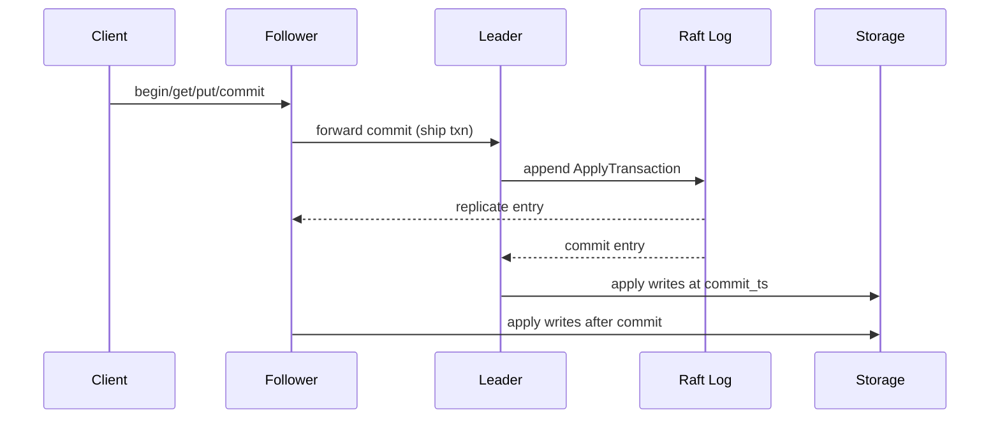
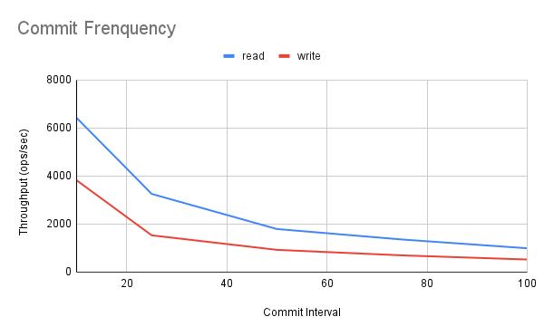
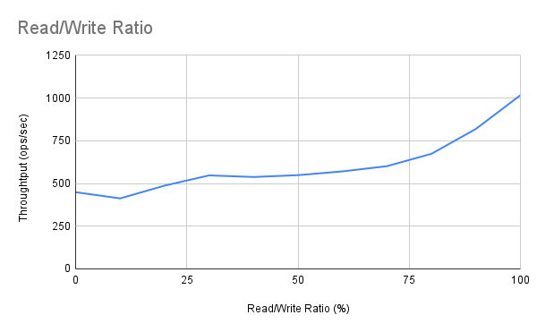
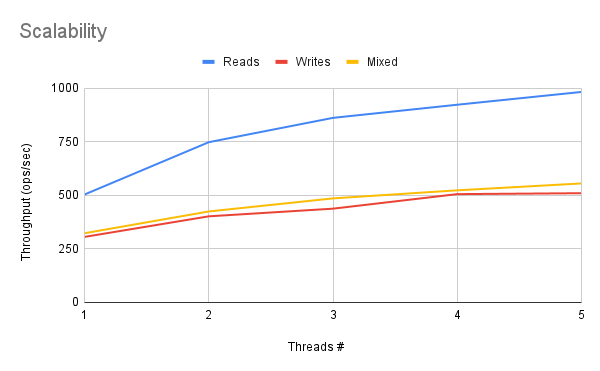

# RivetDB Final Report

## Team
- Sitao Wang - 1003695101 - sitao.wang@mail.utoronto.ca

## Motivation
Operational experience with a distributed task system showed that bolting MariaDB onto a coordination plane created latency, lock contention, and scaling pain. RivetDB explores a lighter path: a transactional, Raft-replicated key-value store with MVCC so readers stay fast and writers are validated optimistically. The goal is a compact, educational prototype that demonstrates the building blocks of distributed databases without a heavyweight dependency footprint.

## Objectives
- Provide a transactional key-value API (`begin_transaction`, `get`, `put`, `commit`, `abort`) that enforces snapshot isolation.
- Replicate commits through Raft to guarantee durability and leader failover.
- Offer both in-memory and file-backed storage engines to exercise MVCC flows and persistence.
- Deliver reproducible builds, tests, and benchmarks that run on Ubuntu/macOS without manual tooling installs.

## Feature
- gRPC transactional API with follower forwarding; Rust client library for ergonomic transactions.
- MVCC storage engine with snapshot reads, OCC validation, staged writes, and abort cleanup.
- Raft-backed replication, leader election, and commit application; configurable memory/disk backends.
- CLI/runtime to launch nodes with peer topology; integration tests for MVCC, Raft failover, client flows, and recovery.
- Benchmark harness that spins up fresh 3-node clusters per run and records CSV/PNG outputs.

## Architecture
- **Data model & API surface**: Key/value store exposed over gRPC (`begin`, `get`, `put`, `commit`, `abort`). Transactions carry a logical snapshot timestamp; reads never mutate state and only record the read set for later validation.
- **MVCC layout & read path**: Each key has a `VersionChain` sorted by commit timestamp. Reads choose the latest committed version with `commit_ts <= snapshot_ts`, enabling repeatable reads without blocking writers. Staged writes are stored per transaction and are never visible until commit; aborts drop staged intents.
- **Write staging, validation, commit**: `stage_write` records intents. On commit, the leader validates that no newer committed version exists for any key in the read set (OCC). If valid, it packages an `ApplyTransaction` with a fresh commit timestamp and appends it to Raft. Once committed, staged writes are drained and appended to MVCC chains at that timestamp.
- **Raft mechanics and use**: Single-leader Raft (OpenRaft) handles elections, log replication, and commit ordering. Client commits enter via `client_write`; followers replicate and apply entries once committed. Followers forward client commits to the leader; commit timestamps advance on the leader to serialize versions. Learners catch up via log replication before serving traffic.
- **Storage backends**: `InMemoryStorage` for volatile testing and `OnDiskStorage` (JSON) for persistence, selectable via `StorageAdapter`.
- **Consistency & isolation**: Snapshot isolation via MVCC + OCC; only committed transactions are replicated and applied, so no partial writes leak.
- **Trade-offs**: OCC keeps reads fast and pushes conflicts to commit time. Single-leader replication simplifies correctness/durability but caps write throughput; batching commits trades latency for throughput up to a point. JSON-backed disk storage favors clarity over write amplification or compaction.



### Recovery & catch-up
- Disk-backed nodes recover by replaying committed Raft entries into storage. Snapshot plumbing exists but payloads are stubbed, so log replay restores state. Memory backend is non-persistent.
- Learners (and followers while catching up) reject client traffic until they have applied the latest log; once caught up they serve reads and forward commits to the leader.


## Performance Benchmarks
- **Environment**: Ubuntu 22.04 on dual-socket Intel Xeon E5-2630 v3 (2.40GHz, 32 vCPUs), SSD-backed storage.
- **Methodology**: For all experiments, a fresh 3-node Raft cluster uses disk-backed storage in temp dirs with 5 client threads. Each workload runs 1000 operations for 7 iterations; charts show the trimmed mean (middle 5). Read-heavy runs seed deterministic keys so reads hit existing data.

### Commit frequency impact
Setup delta: only the commit interval changes for read-only and write-only workloads.

Takeaway: frequent commits still help throughput, especially for writes (3.8k ops/s at 10-op commits down to ~525 ops/s at 100-op commits); batching beyond ~50 ops/commit degrades throughput as Raft entries grow and validation windows widen.

### Read/write mix (100 commits, 1000 ops)
Setup delta: read ratio swept from 0% to 100% while holding 100 commits per 1000 ops.

Takeaway: throughput rises steadily as the workload skews toward reads (roughly 2.3x from 0% to 100% reads); snapshot reads stay cheap while writes pay OCC validation and Raft replication costs.

### Thread scaling (100 commits, 1000 ops)
Setup delta: client threads swept from 1 to 5 at fixed 100 commits/1000 ops.

Takeaway: scaling is near-linear up to ~4 threads; saturation appears by 5 threads (reads ~0.98k ops/s), consistent with a single-leader commit bottleneck.

### Kill/restart resilience (leader killed mid-run)
Setup delta: leader is killed once mid-run and restarted; compared against a no-failure baseline (1000 ops, 100 commits).
| Workload | Scenario | Throughput (ops/s) | Trimmed duration (ms) |
| --- | --- | --- | --- |
| 100% reads, 100 commits | Baseline (no failure) | 992.5 | 1007.6 |
| 100% reads, 100 commits | Leader kill/restart | 746.2 | 1340.2 |
| 100% writes, 100 commits | Baseline (no failure) | 524.5 | 1906.6 |
| 100% writes, 100 commits | Leader kill/restart | 427.6 | 2338.6 |

Takeaway: the cluster survives a leader kill/restart with no failed client operations; throughput dips ~25% for reads and ~18% for writes compared to steady-state.

Raw CSV files live in `benchmark/reports/csv`; rerun with `./benchmark/scripts/*` to regenerate.

## User / Developer Guide
- **API surface**: begin -> get/put -> commit or abort. Followers forward commits to the current leader; learners reject traffic until caught up. Validation conflicts return an error string (`validation conflict`); clients should retry the transaction.
- **Client example (Rust)**:
```rust
use rivetdb::{ClientConfig, RivetClient};

# #[tokio::main]
# async fn main() -> Result<(), Box<dyn std::error::Error>> {
let client = RivetClient::connect(ClientConfig::new("http://127.0.0.1:50051")).await?;
let txn = client.begin_transaction("demo-client").await?;
assert!(txn.get("missing").await?.is_none());
txn.put("item", b"value".to_vec()).await?;
let receipt = txn.commit().await?;
println!("commit timestamp: {}", receipt.commit_ts);
# Ok(())
# }
```
- **Run a single node (memory backend)**:
```bash
cargo run --release -- \
  --node-id 1 \
  --listen-addr 127.0.0.1:50051 \
  --storage memory
```
- **Run a three-node cluster (disk backend)**: open three terminals (adjust paths):
```bash
# Terminal 1
cargo run --release -- --node-id 1 --listen-addr 127.0.0.1:6001 \
  --peer 2=127.0.0.1:6002 --peer 3=127.0.0.1:6003 \
  --storage disk --storage-path /tmp/rivet/node1 --data-dir /tmp/rivet/raft1

# Terminal 2
cargo run --release -- --node-id 2 --listen-addr 127.0.0.1:6002 \
  --peer 1=127.0.0.1:6001 --peer 3=127.0.0.1:6003 \
  --storage disk --storage-path /tmp/rivet/node2 --data-dir /tmp/rivet/raft2

# Terminal 3
cargo run --release -- --node-id 3 --listen-addr 127.0.0.1:6003 \
  --peer 1=127.0.0.1:6001 --peer 2=127.0.0.1:6002 \
  --storage disk --storage-path /tmp/rivet/node3 --data-dir /tmp/rivet/raft3
```
Point clients at any leader or follower; followers forward commits to the leader. Learners reject traffic until caught up.
- **Operational notes**:
  - Storage backends: `--storage memory` (volatile) or `--storage disk` with `--storage-path` (or `--data-dir` fallback) for persistence.
  - Raft: define peers via `--peer <id>=<addr>`; nodes start as voters unless Raft state says otherwise.
  - Recovery: disk-backed runs replay committed commands from the Raft log; snapshot plumbing exists but payloads are stubbed (state is recovered via log replay). Memory backend does not persist across restarts.

## Reproducibility Guide
- **Prerequisites**: Rust toolchain (stable); no system `protoc` needed.
- **Build and test**:
```bash
cargo build --release
cargo test              # integration tests bind to localhost; allow a few seconds for Raft elections
```
- **Benchmarks**: The scripts in `benchmark/scripts` spin up their own 3-node clusters, run workloads for 7 iterations, and write CSVs/PNGs under `benchmark/reports`. No manual servers are needed for benchmarks.
  - `./benchmark/scripts/read_suite.sh` — read-only commit-interval sweep.
  - `./benchmark/scripts/write_suite.sh` — write-only commit-interval sweep.
  - `./benchmark/scripts/thread_scaling_suite.sh` — thread count sweep for reads/writes/mixed.
  - `./benchmark/scripts/mixed_1000_ops_10_commits.sh` — read ratio sweep at fixed commits.
  - `./benchmark/scripts/kill_restart_reads.sh` / `kill_restart_writes.sh` — leader kill/restart mid-run.

## Individual Contributions
Solo project (Sitao Wang):
- Designed and implemented MVCC storage layers (in-memory + on-disk), OCC validation, and transaction manager.
- Built gRPC service and Rust client library with transaction-aware forwarding.
- Integrated OpenRaft (log store, state machine, recovery, metrics registry) and node bootstrap/CLI.
- Authored tests for MVCC invariants, client flows, Raft elections/failover, follower forwarding, and recovery.
- Built the benchmark harness, scripts, and executed the reported experiments.

## Lessons Learned & Conclusion
- Raft serialization sets an upper bound on write throughput; batching helps but increases validation windows. Parallelism mainly benefits read-heavy workloads.
- Separating staged writes from committed versions keeps abort logic simple and makes OCC validation explicit.
- Recovery is practical via Raft log replay even with a lightweight JSON backing; snapshots would further shorten startup time.
- Remaining gaps: durable snapshot payloads, log compaction tuning, richer client retries on conflicts, and authentication for the gRPC surface.

## Video Slide Presentation
TODO - link will be added here.

## Video Demo
TODO - link will be added here.

---
Proposal content is archived in `docs/proposal.md` for reference.
